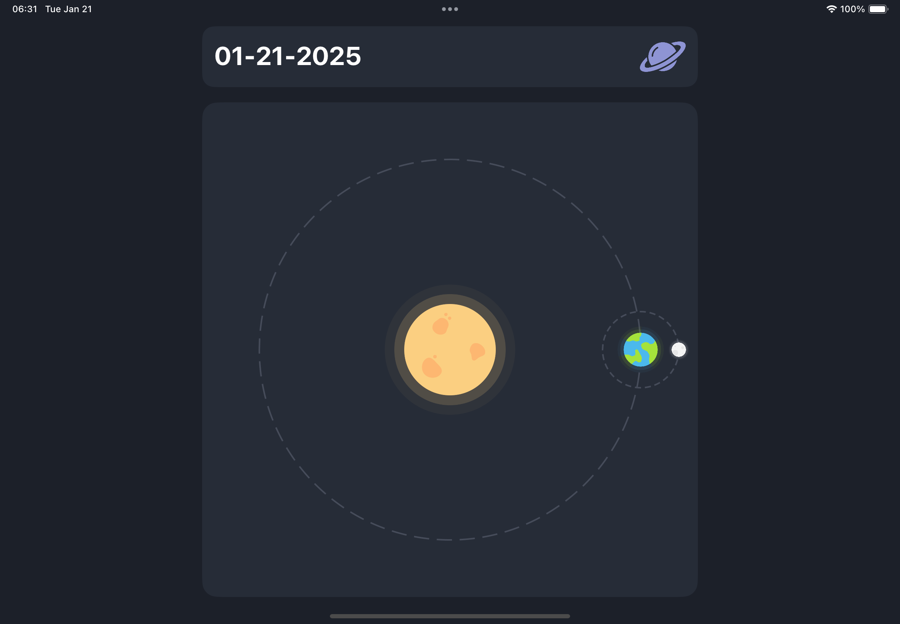

# Clock 

This project was crafted while exploring SwiftUI animations, focusing on the use of .animation to create smooth and dynamic UI interactions.

This project showcases a SwiftUI animation where items spread around a circle and gather back to the center.

## Inspiration 💡

The main idea of this source code based on [Processing Animation](https://dribbble.com/shots/14420202-Processing-Animation) created by [Oleg Frolov](https://dribbble.com/Volorf).

## Screenshots 🌃



## Tools

- Xcode 16.0
- Swift 6.0

## Usage

1. Clone the repository:

  ``` bash
    git clone https://github.com/helloItsHEssam/Clock.git
  ```

###  Contributing 🤝

Contributions, issues, and feature requests are welcome! Feel free to fork the repository and submit a pull request with your changes.

## License

Please check [LICENSE](LICENSE) for details.